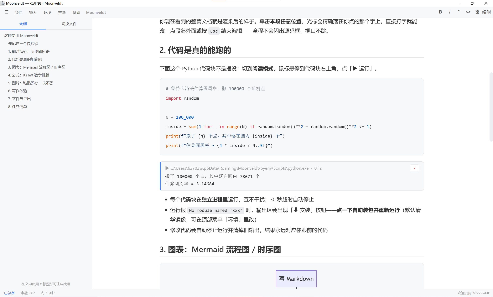
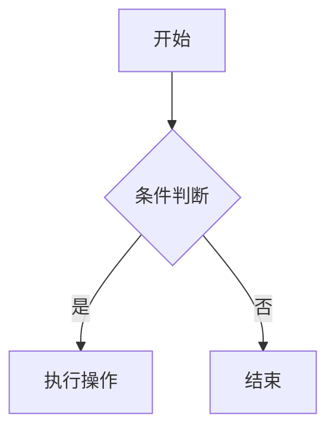
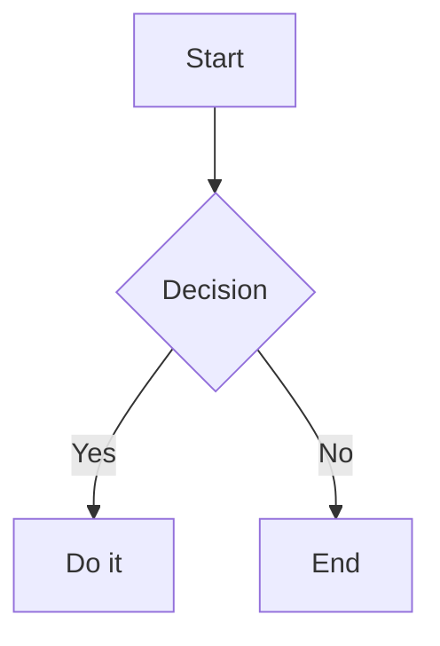

# wwj — Typora 风格 Markdown 编辑器

> 轻量 · 离线 · 免费 · 单窗口所见即所得



---

## 一、中文说明

### 1. 这个项目解决什么问题

- **Typora 收费、重量级**：wwj 提供一个免费、开源思路、极轻量的替代品，界面与交互尽量对齐 Typora
- **Markdown 源码与预览分离，写作不沉浸**：wwj 提供"即时渲染"单栏模式——所见即所得，点击段落直接在渲染结果上编辑，光标精确落在点击处
- **图片链接失效问题**：截图/图片粘贴即自动转为 base64 内嵌进文档（单张 ≤ 15MB），.md 文件拷到任何电脑图片都不会丢
- **在线编辑器依赖网络**：渲染引擎（Markdown / Mermaid / KaTeX）全部本地内置，**完全离线可用**
- **流程图/公式要另开工具**：内置 Mermaid（流程图/时序图/甘特图）与 KaTeX（数学公式）实时渲染
- **Windows 下双击 .md 没有好用的默认编辑器**：安装后自动注册 .md 文件关联，双击即开、Ctrl+S 直接保存回原文件

### 1.1 即时渲染模式（所见即所得）

即时渲染是 wwj 的核心交互，采用与 Typora 相近的「渲染即编辑面」机制：

- **点击任意段落** → 该段直接进入可编辑状态，**光标由浏览器原生精确定位**，点哪个字就落在哪个字上
- **进入编辑零变化**：渲染结果原地保留，不切换成源码框、不闪烁、视口不跳动
- **边打边改**：直接编辑渲染后的文字，表格 / 代码块 / 公式 / 图片所见即所得
- **提交**：点击块外任意处、按 `Esc`，或按 `Ctrl+S` 保存时退出编辑；已修改的块自动转回 Markdown
- `Ctrl+B / Ctrl+I` 加粗 / 斜体；`Shift+Enter` 硬换行；粘贴图片自动 base64 内嵌光标处

### 2. 主要功能

| 功能 | 说明 |
| --- | --- |
| 三种模式 | 编辑（双栏源码+预览）/ **即时渲染**（单栏所见即所得，点击段落原地编辑）/ 阅读，`Ctrl+/` 循环切换 |
| Mermaid 图 | 流程图、时序图、甘特图等，\`\`\`mermaid 代码块自动渲染 |
| 数学公式 | KaTeX：`$行内$` 与 `$$块级$$`，随明暗主题变色 |
| 图片 base64 | 粘贴 / 拖拽 / 选择图片 → 自动内嵌；**打开旧 .md 自动迁移本地图片引用为 base64**（插入菜单可手动重扫），单张 ≤ 15MB |
| 文件操作 | 双击 .md 打开、Ctrl+S 真实保存回原文件、另存为、最近打开（8 条） |
| 导出 | PDF（Ctrl+P）、HTML（含公式/图片）、Markdown |
| 写作辅助 | 专注模式（F8）、打字机模式（F9）、大纲导航、字数统计 |
| 页面缩放 | Ctrl+滚轮 / Ctrl+= / Ctrl+-，50%–300%，全界面缩放，Ctrl+0 重置，自动记忆 |
| 主题 | 浅色 / 深色；支持加载**自定义 CSS** 覆盖样式 |
| 多文档 | 侧边栏管理多个内置文档，localStorage 自动保存 |
| **Python 代码块运行** | 悬停 ```python 代码块点「▶ 运行」→ 输出显示在代码块下方（等宽字体，区别于正文）；wwj 使用独立专属 venv（`%APPDATA%\wwj\pyenv`，首次运行自动创建），**每个代码块独立进程，块间互不影响**（变量不共享）；30 秒超时自动停止；检测到 `uv` 自动加速安装 |
| **运行交互（v1.9.1）** | 运行按钮仅在**阅读模式**显示；输出面板右上角 **×** 关闭（运行中点击会同时停止）；**面板未关闭时不可重复运行**；运行中显示进度条与环境准备阶段；**修改代码会自动停止运行并清除该块输出**（状态与面板严格同步，无孤儿状态）
| **缺包一键安装** | 运行报 `No module named 'x'` 时输出区出现「⬇ 安装 x」按钮 → 点击自动 pip 安装（默认清华镜像，环境面板可切换）→ 完成后自动重跑 |
| **环境管理面板** | 顶部菜单「环境」→ 查看 venv 路径/系统 Python/安装通道，搜索、安装、卸载软件包，实时安装日志 |

### 3. 安装方法

**方式一：便携版（免安装）**
1. 将 `wwj` 目录复制到任意位置（如 `D:\sofft\wwj`）
2. 双击 `wwj.exe` 即可使用
3. 想双击 .md 直接打开：右键任意 .md → 打开方式 → 选择其他应用 → 浏览到 `wwj.exe` → 勾选"始终"

**方式二：安装包（推荐普通用户）**
1. 双击 `wwj-Setup-x.x.x.exe`
2. 选择安装目录（默认在 C 盘用户目录，可改到 D 盘）
3. 安装程序自动注册 .md / .markdown 文件关联、创建桌面与开始菜单快捷方式
4. 首次运行如遇 SmartScreen 蓝色提示（未签名软件的正常提示）：点"更多信息 → 仍要运行"

**方式三：从源码构建（开发者）**

环境要求：Windows 10/11、Node.js ≥ 18、npm

```bash
# 1. 安装依赖
npm install --save-dev electron @electron/packager

# 2. 打包便携版 exe
npx electron-packager . wwj --platform=win32 --arch=x64 --overwrite --icon=wwj.ico --out=dist

# 3.（可选）打包 NSIS 安装包：需 electron-builder@25.1.8，配置见 package.json 的 "build" 字段
npm install --ignore-scripts --save-dev electron-builder@25.1.8
npx electron-builder --win nsis --x64
```

> 中国大陆网络建议设置镜像：`ELECTRON_MIRROR=https://npmmirror.com/mirrors/electron/`

### 4. 使用方法

| 快捷键 | 功能 |
| --- | --- |
| Ctrl+S / Ctrl+O / Ctrl+N | 保存到原文件 / 打开 .md / 新建 |
| Ctrl+B / Ctrl+I | 加粗 / 斜体 |
| Ctrl+/ | 循环切换：编辑 → 即时渲染 → 阅读 |
| Ctrl+J | 开关侧边栏（大纲） |
| Ctrl+滚轮 / Ctrl+= / Ctrl+- / Ctrl+0 | 页面缩放 / 放大 / 缩小 / 重置 |
| F8 / F9 | 专注模式 / 打字机模式 |
| Ctrl+P | 导出 PDF |

- **编辑模式**：左侧写 Markdown 源码，右侧实时预览
- **即时渲染模式**：整篇文档以渲染后效果显示，单击任意段落即可编辑，光标落在点击处；点击块外任意处或按 `Esc` 提交，`Ctrl+S` 提交并保存
- **插图**：直接 Ctrl+V 粘贴截图，或把图片文件拖进窗口，自动转 base64 内嵌
- **打开旧 .md 自动迁移**：用 wwj 打开其他编辑器写的 .md 时，自动检测本地图片引用（相对/绝对路径），读取并内嵌为 base64；网络图片/已内嵌跳过；状态栏提示"有改动（Ctrl+S 保存）"，按 Ctrl+S 才落盘（默认不动你的原文件）
- **主题菜单**：明暗切换、专注/打字机开关、重置缩放、加载自定义 CSS（.css 文件）
- 所有设置（主题/模式/缩放/自定义 CSS）自动记忆

### 5. 输入输出示例

**例 1：基础 Markdown → 排版输出**

输入：

```markdown
# 项目计划
## 里程碑
- [x] 需求分析
- [ ] 开发（**进行中**）

| 阶段 | 时间 |
| --- | --- |
| 开发 | 2 周 |
```

输出：一级/二级标题、带勾选框的任务列表、加粗强调、带边框表格。

**例 2：Mermaid 流程图**

输入：

````markdown

````

输出：自动渲染为矢量流程图，深色主题下自动切换配色。

**例 3：KaTeX 数学公式**

输入：

```markdown
行内公式 $E = mc^2$，块级公式：

$$L(\theta) = -\frac{1}{m}\sum_{i=1}^{m} \left[ y^{(i)}\log h_\theta(x^{(i)}) + (1-y^{(i)})\log(1-h_\theta(x^{(i)})) \right]$$
```

输出：排版级数学公式（逻辑回归损失函数）。

**例 4：图片自动 base64**

操作：截图后按 Ctrl+V（或拖入图片文件）

输入（自动生成）：

```markdown

```

输出：图片直接显示在文档中；base64 数据内嵌在 .md 文件里，文件拷走图片也不会丢。

**例 5：导出**

输入：当前编辑的 .md 文档 → `Ctrl+P`
输出：A4 排版 PDF（保留背景色、Mermaid 图、公式、base64 图片）；亦可导出为带样式的单文件 HTML。

---

## 二、English Documentation

### 1. What Problem Does It Solve

- **Typora is paid and heavyweight**: wwj is a free, lightweight alternative with a familiar Typora-like interface and interaction
- **Source/preview split breaks writing flow**: the "Live Render" single-pane mode is WYSIWYG — click any paragraph to edit it in place, with the cursor landing exactly where you click
- **Broken image links**: pasted/dropped images are automatically embedded as base64 (each ≤ 15MB), so your .md file never loses images when moved
- **Online editors need network**: rendering engines (Markdown / Mermaid / KaTeX) are bundled locally — **fully offline**
- **Diagrams & math need extra tools**: Mermaid (flowchart/sequence/gantt) and KaTeX (math) render in real time
- **No good default .md editor on Windows**: the installer registers the .md file association; double-click to open, Ctrl+S saves back to the original file

### 1. Live Render mode (WYSIWYG)

The core interaction, built on a "the rendered result IS the editor surface" mechanism:

- **Click any paragraph** → it becomes directly editable; the caret is placed by the browser with native precision — click a character to land on it
- **Zero visual change on edit**: the rendered result stays in place — no source-box swap, no flicker, no viewport jump
- **Type in place**: edit the rendered text directly; tables / code blocks / formulas / images are WYSIWYG
- **Commit**: click outside the block or press `Esc`; `Ctrl+S` commits and saves. Modified blocks are converted back to Markdown automatically
- `Ctrl+B / Ctrl+I` bold / italic; `Shift+Enter` hard line break; pasted images embed as base64 at the caret

### 2. Features

| Feature | Description |
| --- | --- |
| Three modes | Edit (dual-pane) / **Live Render** (single-pane WYSIWYG, click to edit in place) / Read, cycle with `Ctrl+/` |
| Mermaid | Flowchart, sequence, gantt diagrams via \`\`\`mermaid blocks |
| Math | KaTeX: `$inline$` and `$$block$$`, theme-aware |
| Images as base64 | Paste / drag / pick → auto-embed (each ≤ 15MB); opening an old .md auto-migrates local image references to base64 (manual rescan via Insert menu) |
| File handling | Double-click .md to open, Ctrl+S saves to the original file, Save As, recent files (8) |
| Export | PDF (Ctrl+P), styled single-file HTML, Markdown |
| Writing aids | Focus mode (F8), typewriter mode (F9), outline pane, word count |
| Zoom | Ctrl+wheel / Ctrl+= / Ctrl+-, 50%–300%, whole UI, Ctrl+0 reset, remembered |
| Themes | Light / Dark; load **custom CSS** to override styles |
| Multi-doc | Manage multiple internal documents in the sidebar, autosaved to localStorage |
| **Run Python blocks** | Hover a ```python block and click "▶ Run" → output appears below the block (monospace, distinct from body text); wwj uses a dedicated venv (`%APPDATA%\wwj\pyenv`, auto-created on first run); **each block runs in its own process — fully isolated from other blocks** (no shared variables); 30s timeout; `uv` auto-detected to speed up installs |
| **Run interactions (v1.9.1)** | Run button shows in **Read mode only**; **×** on the output panel closes it (also stops a running block); re-running is blocked while the panel is open; progress bar + env-preparation stages while running; **editing code auto-stops the run and clears that block's output** (state strictly synced with the panel, no orphan states)
| **One-click missing packages** | On `No module named 'x'` an "⬇ Install x" button appears → installs via pip (Tsinghua mirror by default, switchable in the Environment panel) → auto re-runs the block |
| **Environment panel** | Top menu "环境" → inspect venv path / system Python / install channel, search, install and uninstall packages with live logs |

### 3. Installation

**Option 1: Portable (no install)**
1. Copy the `wwj` folder anywhere (e.g. `D:\sofft\wwj`)
2. Double-click `wwj.exe`
3. To open .md by double-click: right-click any .md → Open with → Choose another app → browse to `wwj.exe` → check "Always"

**Option 2: Installer (recommended)**
1. Double-click `wwj-Setup-x.x.x.exe`
2. Choose the install directory (defaults to C:, changeable to D:)
3. The installer registers .md/.markdown associations and creates shortcuts
4. If SmartScreen appears (normal for unsigned apps): "More info → Run anyway"

**Option 3: Build from source**

Requires: Windows 10/11, Node.js ≥ 18, npm

```bash
# 1. Install dependencies
npm install --save-dev electron @electron/packager

# 2. Package the portable exe
npx electron-packager . wwj --platform=win32 --arch=x64 --overwrite --icon=wwj.ico --out=dist

# 3. (Optional) NSIS installer: electron-builder@25.1.8, config in package.json "build"
npm install --ignore-scripts --save-dev electron-builder@25.1.8
npx electron-builder --win nsis --x64
```

> For mainland China networks: `ELECTRON_MIRROR=https://npmmirror.com/mirrors/electron/`

### 4. Usage

| Shortcut | Action |
| --- | --- |
| Ctrl+S / Ctrl+O / Ctrl+N | Save to file / Open .md / New |
| Ctrl+B / Ctrl+I | Bold / Italic |
| Ctrl+/ | Cycle: Edit → Live Render → Read |
| Ctrl+J | Toggle sidebar (Outline) |
| Ctrl+wheel / Ctrl+= / Ctrl+- / Ctrl+0 | Zoom in / out / reset |
| F8 / F9 | Focus mode / Typewriter mode |
| Ctrl+P | Export PDF |

- **Edit mode**: Markdown source on the left, live preview on the right
- **Live Render mode**: the whole document is displayed rendered; click any paragraph to edit with the caret at the click position, click outside or press `Esc` to commit (or `Ctrl+S` to commit & save)
- **Images**: paste with Ctrl+V or drop image files — auto-embedded as base64 at the caret
- **Theme menu**: light/dark, focus & typewriter toggles, zoom reset, load custom CSS (.css file)
- All preferences (theme/mode/zoom/custom CSS) are remembered automatically

### 5. Input / Output Examples

**Example 1: Basic Markdown → typeset output**

Input:

```markdown
# Project Plan
## Milestones
- [x] Analysis
- [ ] Development (**in progress**)

| Phase | Time |
| --- | --- |
| Dev | 2 weeks |
```

Output: H1/H2 headings, checkbox task list, bold emphasis, bordered table.

**Example 2: Mermaid flowchart**

Input:

````markdown

````

Output: a rendered vector flowchart; colors follow the dark/light theme.

**Example 3: KaTeX math**

Input:

```markdown
Inline $E = mc^2$, block:

$$L(\theta) = -\frac{1}{m}\sum_{i=1}^{m} \left[ y^{(i)}\log h_\theta(x^{(i)}) \right]$$
```

Output: typeset math formulas.

**Example 4: Image → base64**

Action: paste a screenshot with Ctrl+V (or drop an image file)

Generated input:

```markdown

```

Output: the image is displayed inline and permanently embedded in the .md file.

**Example 5: Export**

Input: the current .md → `Ctrl+P`
Output: A4-layout PDF (background colors, Mermaid diagrams, formulas and base64 images preserved); or a single styled HTML file.

---

## 三、项目结构 / Project Structure

```
wwj-app/
├── main.js        # Electron 主进程：窗口、文件读写 IPC、.md 关联打开 / main process
├── preload.js     # contextBridge 安全桥接 / secure bridge
├── index.html     # 全部 UI 与编辑逻辑 / all UI & editor logic
├── libs/          # 本地渲染库（离线可用）/ bundled renderers (offline)
│   ├── marked.min.js / highlight.min.js / mermaid.min.js
│   ├── turndown.js / turndown-plugin-gfm.js   # 即时渲染 HTML→Markdown 转换
│   └── katex/     # KaTeX + 字体 / KaTeX + fonts
├── tests/         # 单元测试与 Electron 冒烟测试 / unit & electron smoke tests
├── wwj.ico        # 应用图标 / app icon
└── package.json   # 构建（packager + electron-builder）配置 / build config
```

## 四、许可证 / License

MIT
